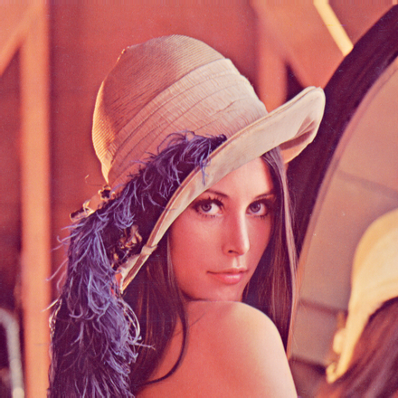
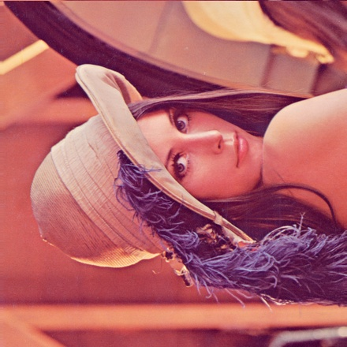
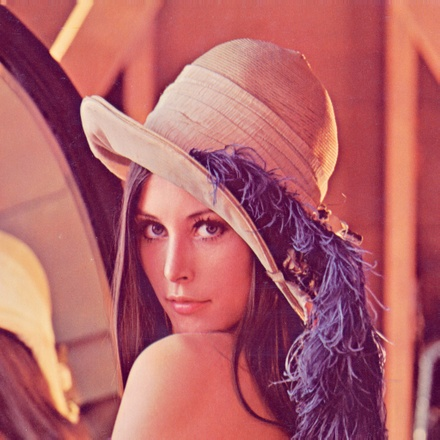
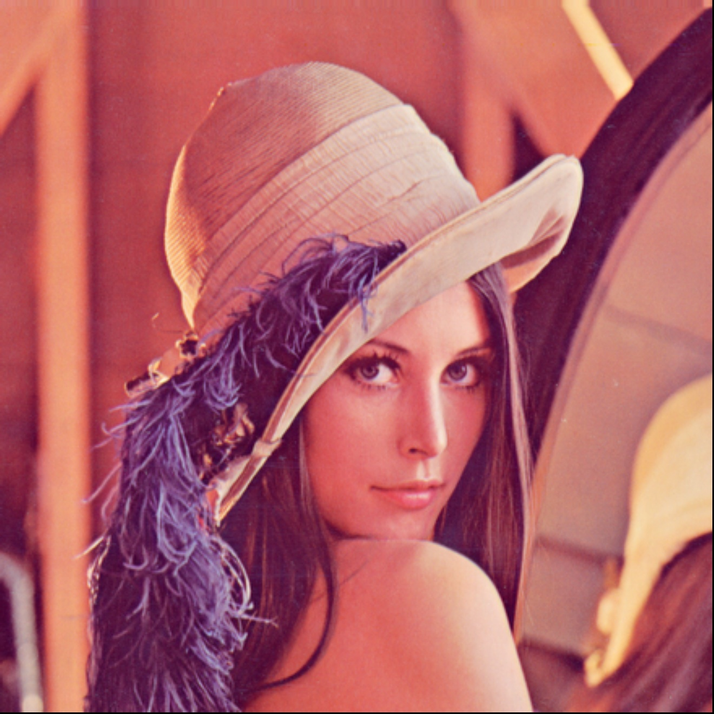
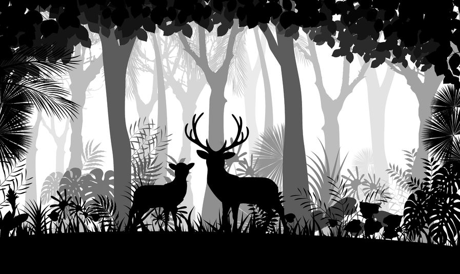
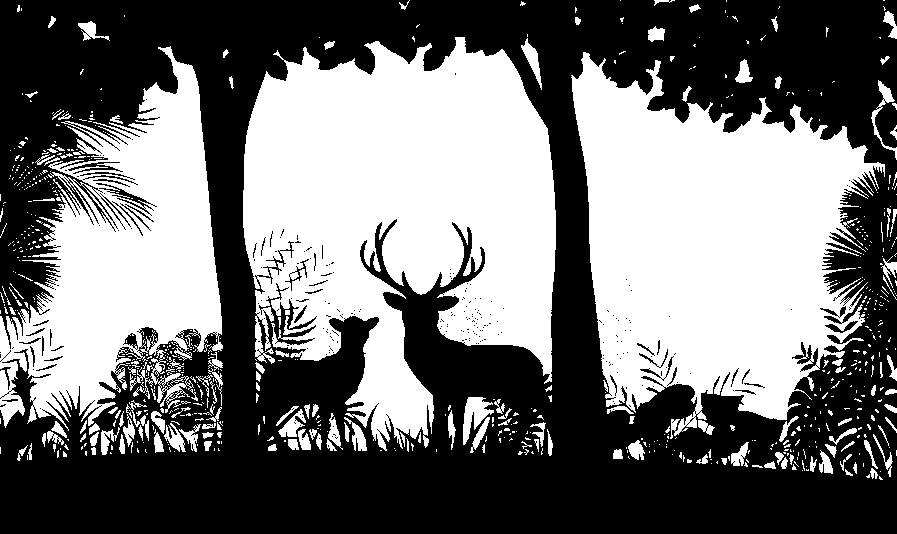

# Computer Vision for UAV Autopolot
### Teacher: Kuan-Wen Chen
This repo contains the lab code in the 2021 Computer Vision for UAV Autopolot course.
For the detail of each lab please refer to its report.

## Lab 1
### Keyword: Image rotaion, flip, interpolation

In this lab, image was rotated, flip and zoom from scratch. For the zoom fuction, nearest and bilinear interpolation methods were tested.

-Original image:
>
<!-- -Rotate result:
>
-Flip result:
> -->
-Nearest interpolation result:
>
-Bilinear interpolation result:
>

## Lab 2
### Keyword: Histogram equalization, Otsu
In this lab, histogram equalization was established. Besides, Otsu algorithm was consturted form scratch.

-Input image
>
-Result Otsu image
>

## Lab 3

## Lab 11
### Keyword: SIFT, SURF, ORB

In this lab, we compare the different method of image charateristic extraction.

-Result:

>

>

>

---
## Final
### Keyword: SLAM

In the final, ORB-SLAM and Colmap were used to modeling the environmnet.

The blue line was Colmap result and the orange dots was ORB-SLAM result.
-Result: (rmse = 0.8131214164989768 )

>

>

---