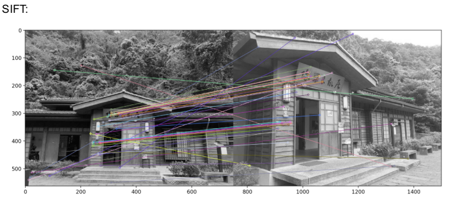
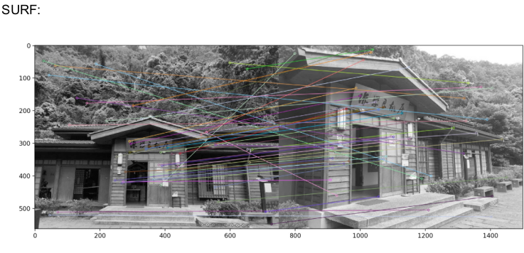
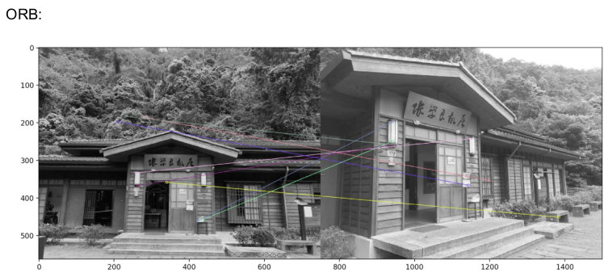
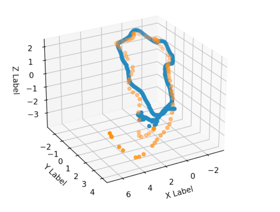

# Computer Vision for UAV Autopolot
### Teacher: Kuan-Wen Chen
This repo contains the lab code in the 2021 Computer Vision for UAV Autopolot course.
For the detail of each lab please refer to its report.

## Lab 11
### Keyword: SIFT, SURF, ORB

In this lab, we compare the different method of image charateristic extraction.

-Result:

>

>

>

---
## Final
### Keyword: SLAM

In the final, ORB-SLAM and Colmap were used to modeling the environmnet.

-Result: (rmse = 0.8131214164989768 )

>

>

---